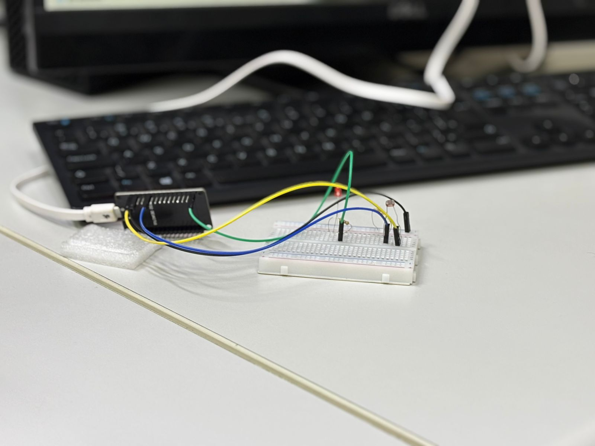

IoT---Detecção de Caixas
Projeto ESP32 - Sensor de Presença e LED Indicador

Circuito
Conexões utilizadas:

Sensor de presença (PIR) → GPIO27 (entrada digital)

LED indicador → GPIO26 (saída digital)

Resistor em série com o LED para limitar corrente

Alimentação: USB (3.3V e GND)

Foto do circuito

(adicione uma foto do seu circuito aqui)

Vídeo de demonstração

(ou adicione o arquivo localmente na pasta videos/ e use a tag <video> no README)

Código

O código-fonte completo está disponível neste repositório na pasta src/.

Como funciona

O sensor PIR detecta movimento quando uma caixa passa na frente.

O ESP32 lê o estado do sensor (0 = sem presença, 1 = presença detectada).

Se houver presença detectada:

O LED acende brevemente para indicar a detecção.

O contador de caixas é incrementado.

O processo se repete a cada nova caixa detectada.

Ajuste do Sensor

O tempo de detecção do PIR pode ser ajustado fisicamente no próprio sensor (geralmente por potenciômetro).

É importante posicionar o sensor de forma que só detecte a passagem das caixas e não do operador.

Requisitos

ESP32

MicroPython instalado

Sensor de presença (PIR)

LED + resistor de 220Ω

Protoboard e jumpers

Resultado esperado

Cada vez que uma caixa passa → LED acende e contador incrementa

Sem caixas → LED apagado

# IoT---Sensores

# Projeto ESP32 - LDR e LED Indicador

Este projeto utiliza um **ESP32** conectado a um **sensor de presença (PIR) ** e para detectar quando uma caixa é posicionada na linha de produção.**  
Quando o ambiente estiver **escuro**, o LED acende.  
Quando o ambiente estiver **claro**, o LED apaga.  

---

## Circuito

### Conexões utilizadas:
- **LDR** → GPIO34 (entrada analógica - ADC)  
- **LED vermelho** → GPIO2 (saída digital)  
- **Resistor** em série com o LED para limitar corrente  
- **Divisor resistivo** com o LDR para leitura da luminosidade  
- **Alimentação**: USB (3.3V e GND)

---

## Foto do circuito

---

## Vídeo de demonstração
  

*(ou adicione o arquivo localmente na pasta `videos/` e use a tag `<video>` no README)*  

---

## Código
O código-fonte completo está disponível neste repositório na pasta **`src/`**.  

---

## Como funciona
1. O **LDR** altera sua resistência de acordo com a luz do ambiente.  
   - Mais luz → menor resistência → maior valor no ADC.  
   - Menos luz → maior resistência → menor valor no ADC.  
2. O ESP32 lê o valor do **ADC (0 a 4095)**.  
3. Se o valor for **menor que o limiar definido**, o LED é aceso.  
4. Caso contrário, o LED permanece apagado.  

---

## Ajuste do Limiar
- O valor de referência para ambiente escuro pode variar.  
- Recomenda-se observar os valores no console e ajustar o limiar conforme necessário.  

---

## Requisitos
- ESP32  
- MicroPython instalado  
- LDR + resistor (divisor de tensão)  
- LED + resistor de 220Ω (ou próximo)  
- Protoboard e jumpers  

---

## Resultado esperado
- Com o ambiente **claro** → LED **apagado**  
- Com o ambiente **escuro** → LED **aceso**  

---

## Autor
Projeto desenvolvido por [**Ana Clara**](https://www.linkedin.com/in/ana-clara-rimualdo-pires-621a2731b)  
Projeto desenvolvido por [**Luiz dos Santos**](www.linkedin.com/in/luiz-santos-788507327)  
IoT---Sensores
Projeto ESP32 - Sensor de Presença e LED Indicador

Este projeto utiliza um ESP32 conectado a um sensor de presença (PIR) para detectar quando uma caixa é posicionada na linha de produção.
Cada vez que uma caixa é detectada, o LED acende brevemente e o contador de caixas é incrementado.

Circuito
Conexões utilizadas:

Sensor PIR → GPIO27 (entrada digital)

LED indicador → GPIO26 (saída digital)

Resistor em série com o LED para limitar corrente

Alimentação: USB (3.3V e GND)

Foto do circuito

Vídeo de demonstração

(ou adicione o arquivo localmente na pasta videos/ e use a tag <video> no README)

Código

O código-fonte completo está disponível neste repositório na pasta src/.

Como funciona

O sensor PIR detecta movimento quando uma caixa passa na frente.

Sem presença → valor 0

Presença detectada → valor 1

O ESP32 lê continuamente o estado do sensor.

Se houver presença detectada:

O LED acende por alguns instantes para indicar a detecção.

O contador de caixas é incrementado e exibido no console.

O processo se repete para cada nova caixa detectada.

Ajuste do Sensor

O tempo de detecção do PIR pode ser ajustado fisicamente no próprio sensor (geralmente por potenciômetro).

Posicione o sensor de forma que só detecte a passagem das caixas e não do operador ou de outros objetos.

Requisitos

ESP32

MicroPython instalado

Sensor de presença (PIR)

LED + resistor de 220Ω (ou próximo)

Protoboard e jumpers

Resultado esperado

Cada vez que uma caixa passa → LED acende e contador incrementa

Sem caixas → LED apagado

Autor

Projeto desenvolvido por Ana Clara

Projeto desenvolvido por Luiz dos Santos